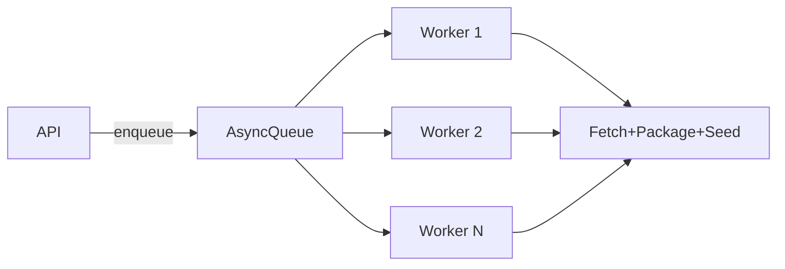
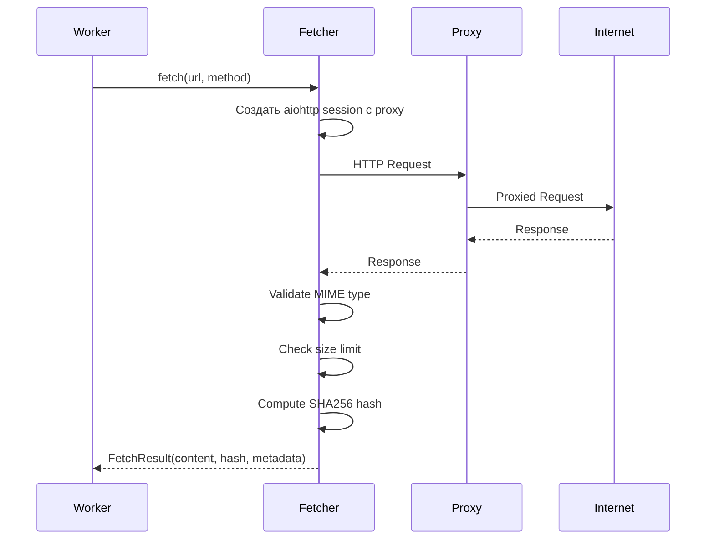
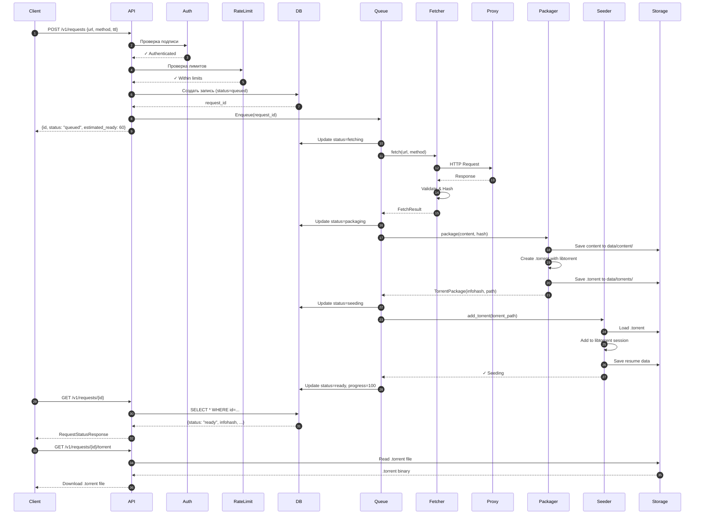
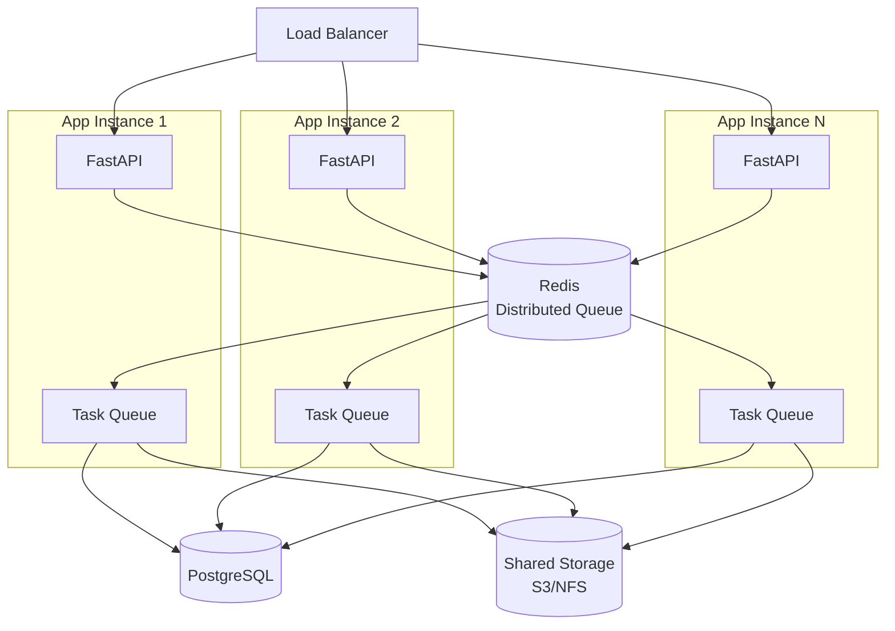
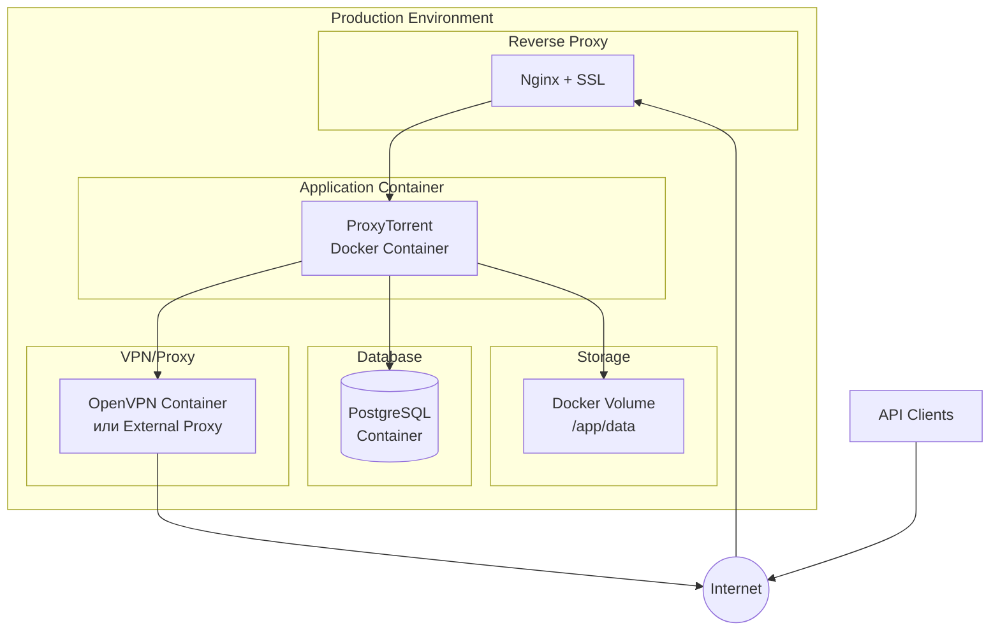

# 3. Обзор архитектуры

## Цель главы

Понять общую структуру системы ProxyTorrent, её компоненты, стек технологий и их взаимодействие.

## Общая архитектура

ProxyTorrent следует модульной архитектуре с чётким разделением ответственности. Система состоит из API-слоя, сервисов обработки, очереди задач и хранилища данных.

### Высокоуровневая диаграмма

```mermaid
graph TB
    Client[Клиент<br/>HTTP/REST]
    
    subgraph "ProxyTorrent Service"
        API[FastAPI Server<br/>API Layer]
        Auth[Authentication<br/>Middleware]
        RateLimit[Rate Limiting<br/>Middleware]
        Queue[Task Queue<br/>Worker Pool]
        
        subgraph "Services"
            Fetcher[Fetcher<br/>HTTP Client]
            Packager[Packager<br/>Torrent Creator]
            Seeder[Seeder<br/>BitTorrent Session]
        end
        
        DB[(Database<br/>SQLite/PostgreSQL)]
        Storage[("Storage<br/>Content/Torrents")]
    end
    
    Proxy[Proxy/VPN<br/>SOCKS5/HTTP]
    Internet((Internet<br/>Target URLs))
    Peers[Torrent Peers<br/>BitTorrent Clients]
    
    Client -->|POST /v1/requests| API
    API --> Auth
    Auth --> RateLimit
    RateLimit --> Queue
    Queue --> Fetcher
    Queue --> Packager
    Queue --> Seeder
    
    Fetcher --> Proxy
    Proxy --> Internet
    
    Fetcher --> Storage
    Packager --> Storage
    Seeder --> Storage
    
    API --> DB
    Queue --> DB
    
    Seeder <-->|BitTorrent Protocol| Peers
    
    Client -->|GET /v1/requests/{id}| API
    Client -->|GET /v1/requests/{id}/torrent| API
```

## Основные компоненты

### 1. API Layer (FastAPI)

**Назначение:** REST API для взаимодействия с клиентами

**Файлы:**
- `src/app/main.py` — главное приложение
- `src/app/api/requests.py` — эндпоинты запросов
- `src/app/api/health.py` — health checks
- `src/app/api/auth.py` — аутентификация
- `src/app/api/ratelimit.py` — rate limiting

**Ключевые возможности:**
- Async request handling (uvicorn + FastAPI)
- OpenAPI/Swagger документация
- CORS middleware
- Pydantic валидация запросов/ответов

**Эндпоинты:**
```
POST   /v1/requests              — создать fetch-запрос
GET    /v1/requests/{id}         — статус запроса
GET    /v1/requests/{id}/torrent — скачать .torrent
GET    /v1/requests/{id}/magnet  — получить magnet link
DELETE /v1/requests/{id}         — отменить запрос
GET    /v1/health                — health check
GET    /docs                     — Swagger UI
```

### 2. Task Queue

**Назначение:** Асинхронная обработка fetch-запросов

**Файлы:**
- `src/app/tasks/queue.py`

**Архитектура:**


**Логика обработки:**
1. API добавляет request_id в очередь
2. Worker забирает задачу
3. Вызывает Fetcher → Packager → Seeder
4. Обновляет статус в БД

**Конфигурация:**
- Количество воркеров настраивается
- Graceful shutdown при остановке
- Retry-логика при ошибках

### 3. Fetcher Service

**Назначение:** Загрузка контента через прокси

**Файлы:**
- `src/app/services/fetcher.py`

**Последовательность работы:**


**Безопасность:**
- MIME type whitelist
- Размер ограничен (по умолчанию 50 МБ)
- SSL verification
- Таймауты (connect: 10s, read: 30s)
- Проксирование обязательно (если `proxy_enabled=true`)

### 4. Packager Service

**Назначение:** Упаковка контента в торренты

**Файлы:**
- `src/app/services/packager.py`

**Content-Addressable Storage:**
```
data/
├── content/
│   └── ab/
│       └── cd/
│           ├── content          # Бинарный контент
│           └── metadata.json    # Метаданные (URL, headers, etc.)
├── torrents/
│   └── abcdef1234567890.torrent
└── resume/
    └── infohash.resume
```

**Процесс упаковки:**
1. Вычислить путь по хешу: `data/content/{hash[:2]}/{hash[2:4]}/{hash}`
2. Сохранить контент и метаданные
3. Создать `.torrent` с помощью libtorrent
4. Установить флаг `private=true` (если настроено)
5. Добавить announce URL (если настроен)
6. Сохранить `.torrent` в `data/torrents/`

**Дедупликация:**
Если контент с таким же хешем уже существует, повторная загрузка не происходит — используется существующий файл.

### 5. Seeder Service

**Назначение:** Раздача торрентов через BitTorrent

**Файлы:**
- `src/app/services/seeder.py`

**libtorrent session:**
```python
session_settings = {
    "enable_dht": False,           # Приватные торренты
    "enable_lsd": False,           # Disable Local Service Discovery
    "anonymous_mode": True,        # Повышенная приватность
    "encryption": "enabled",       # Принудительное шифрование
    "upload_rate_limit": <config>, # Настраиваемо
    "max_connections": <config>
}
```

**Resume data:**
При перезапуске seeder восстанавливает состояние раздачи из `data/resume/`.

### 6. Database Layer

**Назначение:** Хранение метаданных запросов

**Файлы:**
- `src/app/core/database.py`
- `src/app/models/database.py`

**Схема `fetch_requests`:**
```sql
CREATE TABLE fetch_requests (
    id VARCHAR(36) PRIMARY KEY,           -- UUID
    status VARCHAR(20) NOT NULL,          -- queued, fetching, packaging, seeding, ready, failed, cancelled
    url TEXT NOT NULL,
    method VARCHAR(10) NOT NULL,
    headers JSON,
    body TEXT,
    ttl INTEGER NOT NULL,
    content_hash VARCHAR(64),             -- SHA256
    content_size INTEGER,
    content_type VARCHAR(255),
    infohash VARCHAR(40),                 -- BitTorrent infohash
    torrent_path TEXT,
    error_message TEXT,
    progress INTEGER DEFAULT 0,           -- 0-100
    retry_count INTEGER DEFAULT 0,
    created_at DATETIME NOT NULL,
    updated_at DATETIME NOT NULL,
    completed_at DATETIME,
    user_id VARCHAR(255),
    client_ip VARCHAR(45)
);
```

**Статусы запроса:**
- `queued` → `fetching` → `packaging` → `seeding` → `ready`
- `failed` (при ошибке)
- `cancelled` (по запросу пользователя)

### 7. Configuration

**Назначение:** Централизованное управление настройками

**Файлы:**
- `src/app/core/config.py`
- `.env.example`

**Группы настроек:**
- `SecuritySettings` — аутентификация, секреты
- `ProxySettings` — прокси/VPN
- `FetcherSettings` — HTTP клиент
- `TorrentSettings` — создание и раздача
- `StorageSettings` — пути к хранилищу
- `CacheSettings` — TTL, Redis
- `RateLimitSettings` — лимиты запросов
- `DatabaseSettings` — подключение к БД
- `MonitoringSettings` — логирование, метрики

Все настройки загружаются из переменных окружения через Pydantic Settings с валидацией.

## Поток данных

### Полный жизненный цикл запроса



## Стек технологий

### Backend
- **Python 3.11+** — язык программирования
- **FastAPI** — веб-фреймворк
- **Uvicorn** — ASGI сервер
- **Pydantic 2.x** — валидация данных
- **SQLAlchemy 2.x** — ORM (async)
- **aiohttp** — async HTTP клиент
- **aiohttp-socks** — поддержка SOCKS5 прокси
- **libtorrent** — создание и раздача торрентов

### Storage
- **SQLite** (по умолчанию) — БД для MVP
- **PostgreSQL** (опционально) — для продакшена
- **Filesystem** — хранение контента и торрентов

### DevOps
- **Docker** — контейнеризация
- **Docker Compose** — оркестрация
- **pytest** — тестирование
- **ruff** — линтер
- **mypy** — статическая типизация

## Масштабируемость

### Горизонтальное масштабирование



**Возможности масштабирования:**
- API слой stateless — можно запускать множество инстансов
- Shared PostgreSQL с connection pooling
- Shared storage (NFS/S3) для контента
- Redis для распределённой очереди (опционально)

### Вертикальное масштабирование
- Увеличение количества воркеров в очереди
- Больше памяти для кеша
- Быстрые диски для storage

## Безопасность (краткий обзор)

Подробнее см. [Модель безопасности](./08_security_model.md).

**Уровни защиты:**
1. **Сетевой уровень**: все запросы через прокси/VPN
2. **Аутентификация**: HMAC-SHA256 или Bearer tokens
3. **Авторизация**: rate limiting по пользователю и IP
4. **Валидация**: MIME types, размер, SSL verification
5. **Данные**: приватные торренты, шифрование, маскирование в логах

## Производительность

**Асинхронность:**
- FastAPI + asyncio для non-blocking I/O
- aiohttp для параллельных HTTP запросов
- SQLAlchemy async для БД

**Оптимизации:**
- Content-addressable storage → дедупликация
- Опциональный Redis для кеша
- Connection pooling для БД
- Rate limiting для защиты от перегрузки

## Мониторинг и наблюдаемость

**Health checks:**
- `/v1/health` — общее состояние
- Component checks: database, storage, task queue

**Логирование:**
- Структурированные логи (JSON опционально)
- Разные уровни (DEBUG, INFO, WARNING, ERROR)
- Маскирование секретов

**Метрики (планируется):**
- Prometheus metrics
- Request count, duration, errors
- Queue depth, worker utilization

## Источники в коде

### Основные модули
- **API**: `src/app/api/` — requests.py, health.py, auth.py, ratelimit.py
- **Сервисы**: `src/app/services/` — fetcher.py, packager.py, seeder.py
- **Ядро**: `src/app/core/` — config.py, database.py
- **Задачи**: `src/app/tasks/` — queue.py
- **Модели**: `src/app/models/` — database.py, schemas.py
- **Главное**: `src/app/main.py`

### Конфигурация
- `.env.example` — шаблон переменных окружения
- `docker-compose.yml` — оркестрация Docker
- `Dockerfile` — образ приложения
- `pyproject.toml` — зависимости и настройки инструментов

### Документация
- [ARCHITECTURE.md](../../ARCHITECTURE.md) — детальная архитектура
- [README.md](../../README.md) — общая документация

## Проверка/валидация

### Проверить структуру компонентов
```bash
# API endpoints
ls -la src/app/api/
# Должны быть: requests.py, health.py, auth.py, ratelimit.py

# Services
ls -la src/app/services/
# Должны быть: fetcher.py, packager.py, seeder.py

# Task queue
ls -la src/app/tasks/
# Должен быть: queue.py
```

### Проверить работу компонентов
```bash
# Запустить сервис
docker-compose up -d

# API Layer
curl http://localhost:8000/v1/health
# Ожидается: {"status": "healthy", ...}

# Database
docker-compose exec proxytorrent python -c "
from app.core.database import engine
import asyncio
asyncio.run(engine.connect())
print('DB connected')
"

# Storage
ls -la data/
# Должны быть: content/, torrents/, resume/

# Task Queue
docker-compose logs proxytorrent | grep "Task queue started"
# Должно быть сообщение о старте очереди
```

### E2E проверка
```bash
# Полный цикл: создание → обработка → получение торрента
./examples/client.py --url "http://httpbin.org/html" --output test.torrent
ls -lh test.torrent
# Файл должен быть создан

# Проверить все компоненты были задействованы
docker-compose logs proxytorrent | grep -E "(Fetcher|Packager|Seeder)"
```

## Диаграмма деплоймента



## Заключение

ProxyTorrent построен на модульной асинхронной архитектуре с чётким разделением компонентов. Следующие главы детализируют каждый аспект: жизненный цикл запроса, API, конфигурацию, безопасность и развёртывание.

## Связанные главы

- [Жизненный цикл запроса](./04_request_lifecycle.md) — детальный поток обработки
- [API Reference](./05_api_reference.md) — все эндпоинты
- [Модель безопасности](./08_security_model.md) — защита на всех уровнях
- [Deployment](./09_deployment_playbook.md) — развёртывание в продакшен
