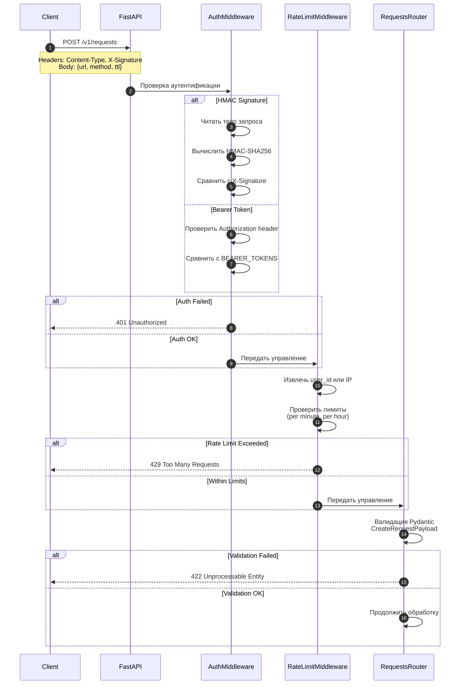
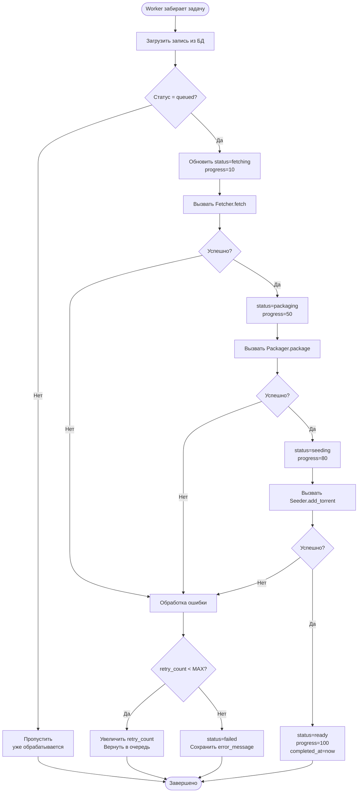
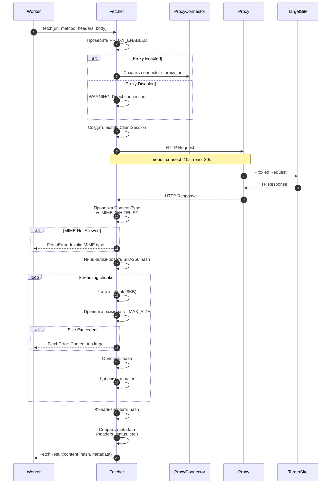
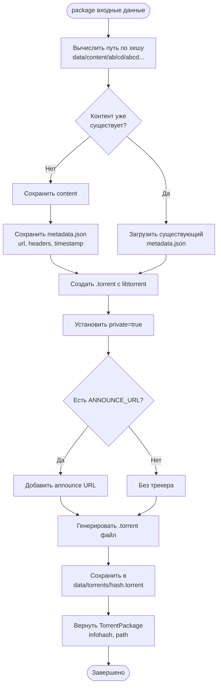
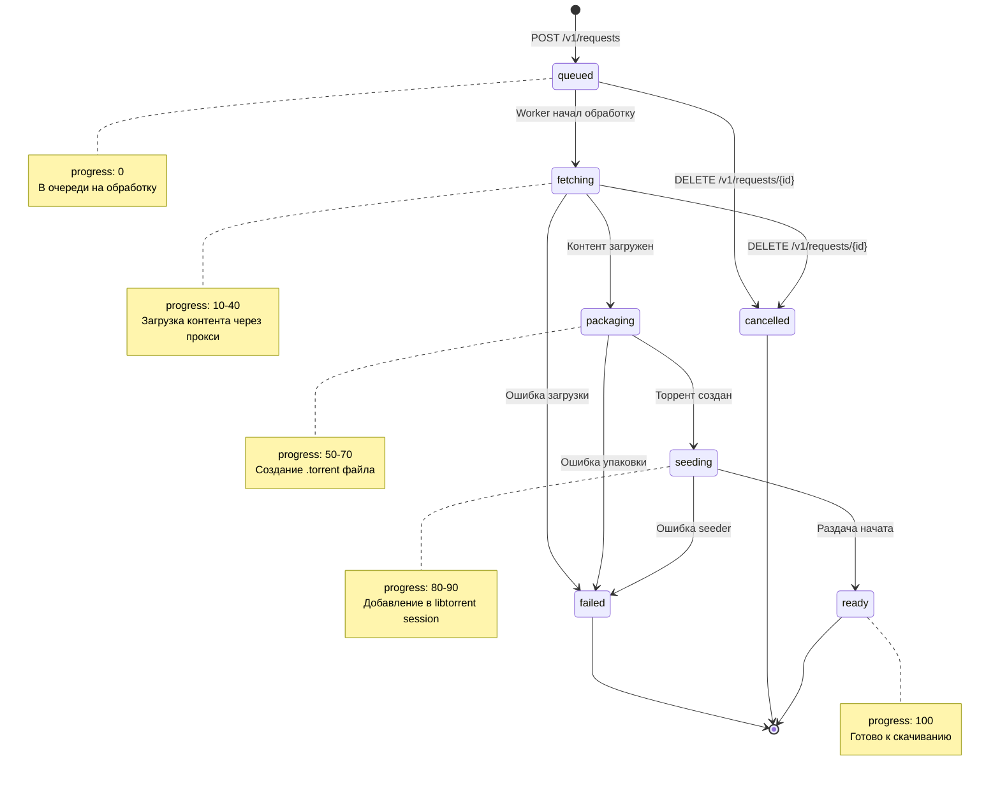

# 4. Жизненный цикл запроса

## Цель главы

Детально описать путь запроса от момента его создания клиентом до получения готового торрент-файла, включая все промежуточные этапы, проверки и обновления статуса.

## Обзор жизненного цикла

Полный цикл обработки запроса проходит через 7 основных фаз:

1. **Приём запроса** — валидация, аутентификация, rate limiting
2. **Создание записи** — сохранение в БД со статусом `queued`
3. **Постановка в очередь** — добавление в task queue
4. **Загрузка контента** — fetch через прокси (статус: `fetching`)
5. **Упаковка в торрент** — создание .torrent (статус: `packaging`)
6. **Начало раздачи** — добавление в seeder (статус: `seeding`)
7. **Готовность** — торрент доступен для скачивания (статус: `ready`)

## Детальная последовательность

### Фаза 1: Приём и валидация запроса



**Файлы:**
- `src/app/api/auth.py` — функции `verify_hmac_signature()`, `verify_bearer_token()`
- `src/app/api/ratelimit.py` — класс `RateLimiter`
- `src/app/api/requests.py` — функция `create_request()`
- `src/app/models/schemas.py` — модель `CreateRequestPayload`

**Проверки на этапе:**
1. ✅ Наличие Content-Type: application/json
2. ✅ Валидность HMAC подписи (если auth enabled)
3. ✅ Соблюдение rate limits
4. ✅ Pydantic валидация полей (url, method, ttl)

### Фаза 2: Создание записи в БД

```python
# Псевдокод из src/app/api/requests.py

async def create_request(
    payload: CreateRequestPayload,
    db: AsyncSession,
    user_id: str | None = None,
    client_ip: str | None = None
) -> RequestResponse:
    # 1. Генерация UUID
    request_id = str(uuid.uuid4())
    
    # 2. Создание записи в БД
    fetch_request = FetchRequest(
        id=request_id,
        status="queued",
        url=payload.url,
        method=payload.method,
        headers=payload.headers,
        body=payload.body,
        ttl=payload.ttl,
        created_at=datetime.utcnow(),
        updated_at=datetime.utcnow(),
        user_id=user_id,
        client_ip=client_ip,
        progress=0
    )
    
    db.add(fetch_request)
    await db.commit()
    await db.refresh(fetch_request)
    
    # 3. Добавление в очередь
    task_queue = get_task_queue()
    await task_queue.enqueue(request_id)
    
    # 4. Возврат ответа клиенту
    return RequestResponse(
        id=request_id,
        status="queued",
        estimated_ready=60,  # примерная оценка
        created_at=fetch_request.created_at
    )
```

**Файлы:**
- `src/app/api/requests.py` — `create_request()`
- `src/app/models/database.py` — модель `FetchRequest`
- `src/app/core/database.py` — async session

**Состояние после фазы:**
- Запись в БД: `status = "queued"`, `progress = 0`
- request_id в task queue
- Клиент получил `request_id` и может начать polling статуса

### Фаза 3: Обработка в Task Queue



**Файлы:**
- `src/app/tasks/queue.py` — класс `TaskQueue`, метод `_process_request()`

**Код воркера (упрощённо):**
```python
async def _process_request(self, request_id: str) -> None:
    async with get_db_session() as db:
        # 1. Загрузить запись
        request = await db.get(FetchRequest, request_id)
        if request.status != "queued":
            return  # уже обрабатывается
        
        try:
            # 2. FETCHING
            request.status = "fetching"
            request.progress = 10
            await db.commit()
            
            fetch_result = await fetcher.fetch(
                url=request.url,
                method=request.method,
                headers=request.headers,
                body=request.body
            )
            
            # 3. PACKAGING
            request.status = "packaging"
            request.progress = 50
            request.content_hash = fetch_result.content_hash
            request.content_size = fetch_result.content_size
            request.content_type = fetch_result.content_type
            await db.commit()
            
            torrent_package = await packager.package(
                content=fetch_result.content,
                content_hash=fetch_result.content_hash,
                metadata=fetch_result.metadata
            )
            
            # 4. SEEDING
            request.status = "seeding"
            request.progress = 80
            request.infohash = torrent_package.infohash
            request.torrent_path = str(torrent_package.torrent_path)
            await db.commit()
            
            await seeder.add_torrent(torrent_package.torrent_path)
            
            # 5. READY
            request.status = "ready"
            request.progress = 100
            request.completed_at = datetime.utcnow()
            await db.commit()
            
        except Exception as e:
            request.status = "failed"
            request.error_message = str(e)
            request.retry_count += 1
            await db.commit()
            raise
```

### Фаза 4: Загрузка контента (Fetcher)



**Файлы:**
- `src/app/services/fetcher.py` — класс `Fetcher`, метод `fetch()`

**Проверки в Fetcher:**
1. ✅ Proxy используется (если `PROXY_ENABLED=true`)
2. ✅ Content-Type в whitelist
3. ✅ Размер не превышает `MAX_SIZE` (50 МБ по умолчанию)
4. ✅ Таймауты не истекли
5. ✅ SSL сертификат валиден (если `VERIFY_SSL=true`)

### Фаза 5: Упаковка в торрент (Packager)



**Файлы:**
- `src/app/services/packager.py` — класс `Packager`, методы `package()`, `_get_content_path()`

**Структура хранения:**
```
data/content/ab/cd/abcdef1234567890.../
├── content          # Бинарный файл контента
└── metadata.json    # {url, headers, timestamp, content_type, etc.}

data/torrents/
└── abcdef1234567890abcdef1234567890.torrent
```

**Преимущества content-addressable storage:**
- Автоматическая дедупликация
- Быстрая проверка наличия контента
- Иммутабельность (хеш = идентификатор)

### Фаза 6: Начало раздачи (Seeder)

```python
# Упрощённый код из src/app/services/seeder.py

class Seeder:
    def __init__(self):
        self.session = libtorrent.session()
        
        # Настройки для приватных торрентов
        settings = {
            "enable_dht": False,
            "enable_lsd": False,
            "anonymous_mode": True,
            "encryption": libtorrent.enc_policy.enabled,
            "upload_rate_limit": config.upload_rate_limit,
            "max_connections": config.max_connections
        }
        self.session.apply_settings(settings)
    
    async def add_torrent(self, torrent_path: Path) -> str:
        # 1. Загрузить .torrent
        info = libtorrent.torrent_info(str(torrent_path))
        
        # 2. Параметры добавления
        params = {
            "ti": info,
            "save_path": str(content_path.parent),
            "flags": libtorrent.torrent_flags.seed_mode
        }
        
        # 3. Добавить в сессию
        handle = self.session.add_torrent(params)
        
        # 4. Сохранить resume data
        await self._save_resume_data(handle)
        
        return info.info_hash().to_hex()
```

**Файлы:**
- `src/app/services/seeder.py` — класс `Seeder`

**После добавления:**
- Торрент активен в libtorrent session
- Resume data сохранён в `data/resume/{infohash}.resume`
- Торрент готов к раздаче peers

### Фаза 7: Получение результата клиентом

После того, как статус стал `ready`, клиент может:

#### 1. Получить статус
```bash
GET /v1/requests/{id}

Response:
{
  "id": "550e8400-...",
  "status": "ready",
  "url": "http://example.com",
  "method": "GET",
  "created_at": "2025-12-13T10:00:00Z",
  "updated_at": "2025-12-13T10:01:30Z",
  "completed_at": "2025-12-13T10:01:30Z",
  "infohash": "abcdef1234567890...",
  "content_hash": "sha256:...",
  "content_size": 12345,
  "content_type": "text/html",
  "progress": 100
}
```

#### 2. Скачать .torrent файл
```bash
GET /v1/requests/{id}/torrent

Response: Binary .torrent file
Content-Type: application/x-bittorrent
Content-Disposition: attachment; filename="content.torrent"
```

#### 3. Получить magnet ссылку
```bash
GET /v1/requests/{id}/magnet

Response:
{
  "id": "550e8400-...",
  "magnet_link": "magnet:?xt=urn:btih:abcdef1234567890...",
  "infohash": "abcdef1234567890..."
}
```

## Диаграмма состояний запроса



## Обработка ошибок

### Типы ошибок и действия

| Ошибка | Фаза | Действие | Статус |
|--------|------|----------|--------|
| Authentication failed | 1 | Вернуть 401 | — |
| Rate limit exceeded | 1 | Вернуть 429 | — |
| Invalid URL | 1 | Вернуть 422 | — |
| Proxy connection failed | 4 | Retry или failed | `failed` |
| Target timeout | 4 | Retry или failed | `failed` |
| Invalid MIME type | 4 | Не retry, failed | `failed` |
| Content too large | 4 | Не retry, failed | `failed` |
| Torrent creation failed | 5 | Retry или failed | `failed` |
| Seeder error | 6 | Retry или failed | `failed` |

### Retry логика

```python
# В src/app/tasks/queue.py

MAX_RETRIES = 3
RETRY_DELAY = 30  # seconds

if request.retry_count < MAX_RETRIES:
    request.retry_count += 1
    request.status = "queued"  # Вернуть в очередь
    await asyncio.sleep(RETRY_DELAY)
else:
    request.status = "failed"
    request.error_message = "Max retries exceeded"
```

## Производительность и таймауты

### Типичное время обработки

| Фаза | Время (примерно) | Параметры |
|------|------------------|-----------|
| 1. Приём запроса | < 100 ms | FastAPI async |
| 2. Создание в БД | < 50 ms | SQLAlchemy async |
| 3. Ожидание в очереди | 0-10 s | Зависит от нагрузки |
| 4. Загрузка контента | 5-30 s | `CONNECT_TIMEOUT=10`, `READ_TIMEOUT=30` |
| 5. Упаковка | 1-5 s | Зависит от размера |
| 6. Seeding | < 1 s | libtorrent add |
| **Итого** | **10-60 s** | Для контента < 10 МБ |

### Настройка таймаутов

```bash
# В .env
FETCHER__CONNECT_TIMEOUT=10      # Подключение к прокси/сайту
FETCHER__READ_TIMEOUT=30         # Чтение ответа
FETCHER__MAX_SIZE=52428800       # 50 МБ лимит

# Увеличить для больших файлов (например, видео)
FETCHER__READ_TIMEOUT=300        # 5 минут
FETCHER__MAX_SIZE=524288000      # 500 МБ
```

## Источники в коде

### Основные файлы
- **API endpoints**: `src/app/api/requests.py`
- **Auth/RateLimit**: `src/app/api/auth.py`, `src/app/api/ratelimit.py`
- **Task Queue**: `src/app/tasks/queue.py`
- **Services**: `src/app/services/fetcher.py`, `packager.py`, `seeder.py`
- **Models**: `src/app/models/database.py`, `schemas.py`

### Конфигурация
- `.env.example` — все таймауты и лимиты
- `src/app/core/config.py` — загрузка настроек

## Проверка/валидация

### Отслеживание полного цикла

```bash
# 1. Создать запрос с логированием
REQUEST_ID=$(curl -s -X POST http://localhost:8000/v1/requests \
  -H "Content-Type: application/json" \
  -d '{"url":"http://httpbin.org/html","method":"GET","ttl":3600}' | jq -r '.id')

echo "Request ID: $REQUEST_ID"

# 2. Мониторить статус каждые 2 секунды
watch -n 2 "curl -s http://localhost:8000/v1/requests/$REQUEST_ID | jq '{status, progress, error_message}'"

# 3. Смотреть логи в реальном времени
docker-compose logs -f proxytorrent | grep "$REQUEST_ID"

# 4. После ready — скачать торрент
curl http://localhost:8000/v1/requests/$REQUEST_ID/torrent -o result.torrent
ls -lh result.torrent
```

### Проверка каждой фазы

```bash
# Фаза 1: API & Auth
curl -X POST http://localhost:8000/v1/requests \
  -H "Content-Type: application/json" \
  -d '{"url":"http://httpbin.org/html","method":"GET","ttl":3600}'
# Ожидается: {"id": "...", "status": "queued"}

# Фаза 2: БД
docker-compose exec proxytorrent python -c "
from app.core.database import get_db_session
from app.models.database import FetchRequest
import asyncio

async def check():
    async with get_db_session() as db:
        result = await db.execute('SELECT count(*) FROM fetch_requests WHERE status=\"queued\"')
        print(f'Queued requests: {result.scalar()}')

asyncio.run(check())
"

# Фаза 3: Queue
docker-compose logs proxytorrent | grep "Processing request"

# Фаза 4: Fetcher
docker-compose logs proxytorrent | grep -i "fetch"

# Фаза 5: Packager
ls -la data/content/
ls -la data/torrents/

# Фаза 6: Seeder
docker-compose logs proxytorrent | grep -i "seeder"
ls -la data/resume/
```

### Тестирование ошибок

```bash
# Невалидный URL
curl -X POST http://localhost:8000/v1/requests \
  -H "Content-Type: application/json" \
  -d '{"url":"invalid-url","method":"GET","ttl":3600}'
# Ожидается: 422 Unprocessable Entity

# Недоступный хост
REQUEST_ID=$(curl -s -X POST http://localhost:8000/v1/requests \
  -H "Content-Type: application/json" \
  -d '{"url":"http://unreachable-host-12345.com","method":"GET","ttl":3600}' | jq -r '.id')
sleep 15
curl -s http://localhost:8000/v1/requests/$REQUEST_ID | jq '{status, error_message}'
# Ожидается: status="failed", error_message содержит описание ошибки

# Превышение размера (если настроен MIME whitelist без image/*)
REQUEST_ID=$(curl -s -X POST http://localhost:8000/v1/requests \
  -H "Content-Type: application/json" \
  -d '{"url":"http://httpbin.org/image/png","method":"GET","ttl":3600}' | jq -r '.id')
sleep 15
curl -s http://localhost:8000/v1/requests/$REQUEST_ID | jq .status
# Может быть failed, если image/* не в whitelist
```

## Заключение

Жизненный цикл запроса в ProxyTorrent проходит через 7 чётко определённых фаз, каждая из которых обновляет статус и прогресс в БД. Клиент может в любой момент проверить статус и, когда обработка завершена, получить готовый торрент-файл или magnet-ссылку.

## Связанные главы

- [Архитектура](./03_architecture_overview.md) — общая картина системы
- [API Reference](./05_api_reference.md) — все эндпоинты подробно
- [Storage](./07_storage_and_data_model.md) — структура хранения
- [Security](./08_security_model.md) — проверки безопасности на каждом этапе
