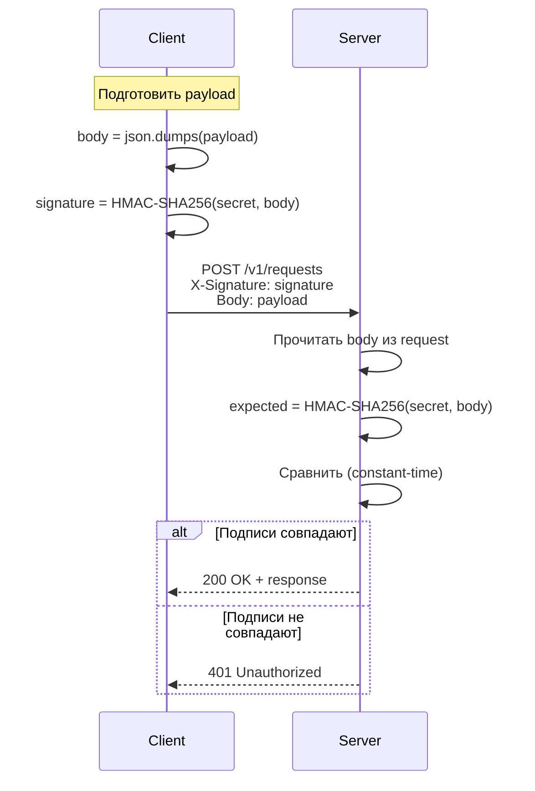

# 8. Модель безопасности

## Цель главы

Описать все аспекты безопасности ProxyTorrent: аутентификацию, авторизацию, защиту данных, сетевую изоляцию и рекомендации по безопасному развёртыванию.

## Принципы безопасности

### Defense in Depth (эшелонированная защита)

ProxyTorrent применяет многоуровневую защиту:

1. **Сетевой уровень** — изоляция через прокси/VPN
2. **Транспортный уровень** — HTTPS (через reverse proxy)
3. **Аутентификация** — HMAC-SHA256 или Bearer tokens
4. **Авторизация** — rate limiting
5. **Валидация** — входных данных, MIME types, размеров
6. **Данные** — шифрование торрентов, маскирование в логах

### Security by Default

Безопасные настройки по умолчанию:
- ✅ Аутентификация включена (`SECURITY__AUTH_ENABLED=true`)
- ✅ Прокси обязателен (`PROXY__PROXY_ENABLED=true`)
- ✅ Приватные торренты (`TORRENT__PRIVATE_TRACKER=true`)
- ✅ SSL verification (`FETCHER__VERIFY_SSL=true`)
- ✅ Rate limiting (`RATE_LIMIT__RATE_LIMIT_ENABLED=true`)
- ✅ Маскирование секретов в логах (`MONITORING__MASK_SENSITIVE=true`)

## Аутентификация

### 1. HMAC-SHA256 Signature (рекомендуется)

**Принцип:** Клиент вычисляет HMAC-подпись тела запроса с общим секретом и отправляет её в заголовке `X-Signature`.

**Схема:**


**Реализация (клиент):**
```python
import hmac
import hashlib
import json

secret = "your-hmac-secret"
payload = {"url": "http://example.com", "method": "GET", "ttl": 3600}
body = json.dumps(payload)

signature = hmac.new(
    secret.encode(),
    body.encode(),
    hashlib.sha256
).hexdigest()

headers = {
    "Content-Type": "application/json",
    "X-Signature": signature
}

requests.post("http://localhost:8000/v1/requests", headers=headers, data=body)
```

**Реализация (сервер):**
```python
# src/app/api/auth.py

import hmac
import hashlib

async def verify_hmac_signature(
    request_body: bytes,
    signature: str,
    secret: str
) -> bool:
    """Проверка HMAC подписи."""
    expected_signature = hmac.new(
        secret.encode(),
        request_body,
        hashlib.sha256
    ).hexdigest()
    
    # Constant-time comparison для защиты от timing attacks
    return hmac.compare_digest(signature, expected_signature)
```

**Преимущества:**
- ✅ Защита от подделки запросов
- ✅ Защита от replay attacks (с добавлением timestamp в payload)
- ✅ Не передаёт секрет по сети
- ✅ Защита от timing attacks (constant-time сравнение)

**Недостатки:**
- ❌ Требует синхронизации секрета между клиентом и сервером
- ❌ Сложнее в реализации, чем Bearer token

### 2. Bearer Token

**Принцип:** Клиент отправляет заранее известный токен в заголовке `Authorization`.

**Пример:**
```bash
curl -X POST http://localhost:8000/v1/requests \
  -H "Authorization: Bearer my-secret-token" \
  -H "Content-Type: application/json" \
  -d '{"url":"http://example.com","method":"GET","ttl":3600}'
```

**Реализация:**
```python
# src/app/api/auth.py

def verify_bearer_token(token: str, valid_tokens: list[str]) -> bool:
    """Проверка Bearer токена."""
    return token in valid_tokens
```

**Настройка:**
```bash
# В .env
SECURITY__BEARER_TOKENS=token1,token2,secret-xyz
```

**Преимущества:**
- ✅ Простота реализации
- ✅ Поддержка нескольких токенов
- ✅ Легко ротировать токены

**Недостатки:**
- ❌ Токен передаётся в каждом запросе (риск перехвата без HTTPS)
- ❌ Нет защиты от replay attacks

### 3. Отключение аутентификации (только для dev)

```bash
SECURITY__AUTH_ENABLED=false
```

**⚠️ КРИТИЧЕСКИ ВАЖНО:** 
- Используйте **ТОЛЬКО** в dev-окружении!
- **НИКОГДА** не используйте в продакшене!
- Отключает всю защиту — любой может создавать запросы

## Авторизация и Rate Limiting

### Rate Limiting

ProxyTorrent защищается от DoS-атак через rate limiting на двух уровнях:

1. **Per-user** (по `user_id` из аутентификации)
2. **Per-IP** (по IP-адресу клиента)

**Лимиты по умолчанию:**
```python
RATE_LIMIT__REQUESTS_PER_MINUTE=60      # 60 запросов/мин на пользователя
RATE_LIMIT__REQUESTS_PER_HOUR=1000      # 1000 запросов/час на пользователя
RATE_LIMIT__REQUESTS_PER_IP_MINUTE=100  # 100 запросов/мин с одного IP
```

**Реализация (упрощённо):**
```python
# src/app/api/ratelimit.py

from collections import defaultdict
from datetime import datetime, timedelta

class RateLimiter:
    def __init__(self):
        self.requests = defaultdict(list)  # user_id -> [timestamps]
    
    def check_limit(self, user_id: str, limit: int, window: int) -> bool:
        """
        Проверить лимит для пользователя.
        
        Args:
            user_id: ID пользователя
            limit: Максимум запросов
            window: Временное окно в секундах
        """
        now = datetime.utcnow()
        cutoff = now - timedelta(seconds=window)
        
        # Удалить старые записи
        self.requests[user_id] = [
            ts for ts in self.requests[user_id] if ts > cutoff
        ]
        
        # Проверить лимит
        if len(self.requests[user_id]) >= limit:
            return False  # Превышен лимит
        
        # Добавить текущий запрос
        self.requests[user_id].append(now)
        return True
```

**HTTP ответ при превышении:**
```http
HTTP/1.1 429 Too Many Requests
X-RateLimit-Limit: 60
X-RateLimit-Remaining: 0
X-RateLimit-Reset: 1670923200
Retry-After: 60

{
  "detail": "Rate limit exceeded. Try again later."
}
```

## Сетевая безопасность

### Изоляция через прокси/VPN

**Обязательное требование для продакшена:**
```bash
PROXY__PROXY_ENABLED=true
```

**Проверка enforcement:**
```python
# src/app/services/fetcher.py

async def fetch(self, url: str, method: str) -> FetchResult:
    if self.config.proxy_enabled and not self.config.proxy_url:
        raise ConfigError("Proxy enabled but not configured")
    
    if self.config.proxy_enabled:
        # Создать connector с прокси
        connector = ProxyConnector.from_url(self.config.proxy_url)
    else:
        logger.warning("⚠️  Proxy disabled — direct connection (UNSAFE)")
        connector = None
    
    # ...
```

**Архитектура:**
```
Client Request
     ↓
ProxyTorrent API
     ↓
Fetcher (enforce proxy check)
     ↓
Proxy/VPN Gateway
     ↓
Internet (Target Site)
```

**Варианты прокси:**

1. **SOCKS5 (рекомендуется для VPN):**
   ```bash
   PROXY__PROXY_TYPE=socks5
   PROXY__PROXY_HOST=vpn-gateway.example.com
   PROXY__PROXY_PORT=1080
   ```

2. **HTTP/HTTPS proxy:**
   ```bash
   PROXY__PROXY_TYPE=http
   PROXY__PROXY_HOST=proxy.example.com
   PROXY__PROXY_PORT=8080
   ```

3. **VPN через Docker network:**
   ```yaml
   # docker-compose.yml
   vpn:
     image: dperson/openvpn-client
     cap_add:
       - NET_ADMIN
     devices:
       - /dev/net/tun
   
   proxytorrent:
     network_mode: "service:vpn"  # Весь трафик через VPN
   ```

### SSL/TLS Verification

**По умолчанию включено:**
```bash
FETCHER__VERIFY_SSL=true
```

**Защита от:**
- Man-in-the-Middle (MITM) attacks
- Поддельных SSL-сертификатов
- Перехвата трафика

**Отключение (только для тестирования):**
```bash
FETCHER__VERIFY_SSL=false  # ⚠️  Только для dev!
```

## Защита данных

### Приватные торренты

**По умолчанию:**
```bash
TORRENT__PRIVATE_TRACKER=true
```

**Эффект:**
- ❌ DHT отключён
- ❌ LSD (Local Service Discovery) отключён
- ❌ PEX (Peer Exchange) отключён
- ✅ Раздача только через явный tracker
- ✅ IP-адреса peers не публикуются

**Реализация:**
```python
# src/app/services/seeder.py

session_settings = {
    "enable_dht": False,        # Отключить DHT
    "enable_lsd": False,        # Отключить LSD
    "anonymous_mode": True,     # Режим анонимности
}
self.session.apply_settings(session_settings)
```

### Шифрование торрентов

```bash
TORRENT__ENCRYPTION_ENABLED=true
```

**Типы шифрования:**
- Encrypted connections между peers
- Message Stream Encryption (MSE)

**Настройка:**
```python
settings = {
    "encryption": libtorrent.enc_policy.enabled,  # Принудительное шифрование
}
```

### Маскирование чувствительных данных в логах

```bash
MONITORING__MASK_SENSITIVE=true
```

**Примеры маскирования:**
```python
# ПЛОХО (секрет в логах):
logger.info(f"Using HMAC secret: {secret}")

# ХОРОШО (маскировано):
logger.info(f"Using HMAC secret: {'*' * 8}")

# Автоматическая маскировка в config.py:
def __repr__(self):
    return f"SecuritySettings(hmac_secret={'***'})"
```

### Content-addressable storage (иммутабельность)

- Контент хранится по SHA256 хешу
- Хеш не может быть изменён без изменения контента
- Защита от подмены данных
- Верификация целостности

## Валидация и ограничения

### 1. Валидация URL

```python
from pydantic import HttpUrl

class CreateRequestPayload(BaseModel):
    url: HttpUrl  # Автоматическая валидация URL
```

**Проверки:**
- ✅ Валидная схема (http/https)
- ✅ Валидный домен
- ❌ Блокировка localhost/internal IPs (опционально)

### 2. MIME Type Whitelist

```bash
FETCHER__MIME_WHITELIST=["text/html","text/plain","application/json"]
```

**Защита от:**
- Загрузки исполняемых файлов
- Вредоносного контента
- Непредвиденных типов данных

**Реализация:**
```python
def _validate_content_type(self, content_type: str) -> bool:
    for allowed in self.config.mime_whitelist:
        if allowed.endswith("/*"):
            prefix = allowed[:-2]
            if content_type.startswith(prefix):
                return True
        elif content_type.startswith(allowed):
            return True
    return False
```

### 3. Ограничение размера

```bash
FETCHER__MAX_SIZE=52428800  # 50 МБ
```

**Защита от:**
- Исчерпания памяти
- Исчерпания дискового пространства
- DoS через большие файлы

**Реализация:**
```python
total_size = 0
async for chunk in response.content.iter_chunked(8192):
    total_size += len(chunk)
    if total_size > self.config.max_size:
        raise FetchError("Content too large")
    buffer.extend(chunk)
```

### 4. Таймауты

```bash
FETCHER__CONNECT_TIMEOUT=10  # Подключение
FETCHER__READ_TIMEOUT=30     # Чтение ответа
```

**Защита от:**
- Зависания на недоступных хостах
- Медленных ответов (slowloris-style attacks)
- Исчерпания ресурсов воркеров

## HTTPS и Reverse Proxy

### Рекомендуемая архитектура для продакшена

```
Internet
   ↓
Nginx (SSL/TLS termination)
   ↓ http://localhost:8000
ProxyTorrent
```

**Nginx конфигурация:**
```nginx
server {
    listen 443 ssl http2;
    server_name api.proxytorrent.example.com;
    
    # SSL
    ssl_certificate /etc/letsencrypt/live/example.com/fullchain.pem;
    ssl_certificate_key /etc/letsencrypt/live/example.com/privkey.pem;
    ssl_protocols TLSv1.2 TLSv1.3;
    ssl_ciphers HIGH:!aNULL:!MD5;
    
    # Security headers
    add_header Strict-Transport-Security "max-age=31536000; includeSubDomains" always;
    add_header X-Content-Type-Options "nosniff" always;
    add_header X-Frame-Options "DENY" always;
    
    # Rate limiting
    limit_req_zone $binary_remote_addr zone=api:10m rate=10r/s;
    
    location / {
        limit_req zone=api burst=20 nodelay;
        
        proxy_pass http://localhost:8000;
        proxy_set_header Host $host;
        proxy_set_header X-Real-IP $remote_addr;
        proxy_set_header X-Forwarded-For $proxy_add_x_forwarded_for;
        proxy_set_header X-Forwarded-Proto $scheme;
    }
}

# Redirect HTTP to HTTPS
server {
    listen 80;
    server_name api.proxytorrent.example.com;
    return 301 https://$server_name$request_uri;
}
```

## Безопасность окружения

### Переменные окружения и секреты

**НЕ ДЕЛАЙТЕ:**
```bash
# ❌ Хранение секретов в git
git add .env
git commit -m "Add config"

# ❌ Секреты в docker-compose.yml в открытом виде
environment:
  - SECURITY__HMAC_SECRET=plaintext-secret
```

**ДЕЛАЙТЕ:**
```bash
# ✅ .env в .gitignore
echo ".env" >> .gitignore

# ✅ Использование secrets в Docker Swarm
docker secret create hmac_secret -
cat hmac_secret.txt | docker secret create hmac_secret -

# ✅ Использование secret managers
# AWS Secrets Manager, HashiCorp Vault, etc.
```

### Права доступа к файлам

```bash
# Ограничить доступ к .env
chmod 600 .env

# Ограничить доступ к data/
chmod 700 data/
chown -R app:app data/

# В Dockerfile
RUN useradd -r -u 1000 app
USER app
```

### Firewall

```bash
# Разрешить только необходимые порты
ufw allow 22/tcp    # SSH
ufw allow 80/tcp    # HTTP (для редиректа)
ufw allow 443/tcp   # HTTPS
ufw deny 8000/tcp   # Не открывать app порт напрямую
ufw enable
```

## Аудит и мониторинг безопасности

### Логирование security events

```python
# Успешная аутентификация
logger.info(f"Authenticated request from {user_id} (IP: {client_ip})")

# Неудачная аутентификация
logger.warning(f"Authentication failed from IP: {client_ip}")

# Rate limit exceeded
logger.warning(f"Rate limit exceeded for {user_id} (IP: {client_ip})")

# Невалидный MIME type
logger.warning(f"Blocked invalid MIME type: {content_type} from {url}")
```

### Метрики безопасности (planned)

- Количество неудачных аутентификаций
- Rate limit hits
- Блокировки по MIME type
- Блокировки по размеру

## Чеклист безопасности для продакшена

### Обязательные меры

- [ ] `SECURITY__AUTH_ENABLED=true`
- [ ] `SECURITY__HMAC_SECRET` = сильный случайный ключ (32+ байта)
- [ ] `PROXY__PROXY_ENABLED=true` и настроен прокси/VPN
- [ ] `FETCHER__VERIFY_SSL=true`
- [ ] `TORRENT__PRIVATE_TRACKER=true`
- [ ] `TORRENT__ENCRYPTION_ENABLED=true`
- [ ] `DEBUG=false`
- [ ] `MONITORING__MASK_SENSITIVE=true`
- [ ] Nginx с SSL/TLS (Let's Encrypt)
- [ ] `.env` в `.gitignore`
- [ ] `chmod 600 .env`
- [ ] Firewall настроен (только 80, 443, SSH)
- [ ] Rate limiting включён
- [ ] Регулярные обновления зависимостей
- [ ] Backup секретов и БД

### Рекомендуемые меры

- [ ] PostgreSQL вместо SQLite
- [ ] Ротация HMAC секрета (ежемесячно/ежеквартально)
- [ ] Мониторинг логов на security events
- [ ] Fail2ban для защиты от brute force
- [ ] Ограничение MIME whitelist только нужными типами
- [ ] WAF (Web Application Firewall) на Nginx
- [ ] Регулярные security audits кода
- [ ] Penetration testing

## Известные угрозы и митигация

### 1. SSRF (Server-Side Request Forgery)

**Угроза:** Злоумышленник может указать внутренний URL (например, `http://localhost:6379`)

**Митигация:**
- Валидация URL (блокировка локальных IP)
- MIME type whitelist
- Размерные ограничения

**TODO:** Добавить проверку на internal IPs

### 2. DoS через большие файлы

**Угроза:** Запрос на скачивание файла 10 ГБ

**Митигация:**
- ✅ `FETCHER__MAX_SIZE` ограничение
- ✅ Streaming с проверкой размера
- ✅ Rate limiting

### 3. Rate limit bypass

**Угроза:** Атакующий с множества IP-адресов

**Митигация:**
- Cloudflare/WAF на уровне выше
- IP-based rate limiting
- Captcha для подозрительных запросов (TODO)

### 4. Replay attacks

**Угроза:** Повторное использование перехваченного запроса

**Митигация:**
- HTTPS (защита от перехвата)
- Добавление timestamp в HMAC payload (TODO)
- Nonce для одноразовых подписей (TODO)

## Источники в коде

- **Аутентификация**: `src/app/api/auth.py`
- **Rate Limiting**: `src/app/api/ratelimit.py`
- **Fetcher валидация**: `src/app/services/fetcher.py`
- **Seeder настройки**: `src/app/services/seeder.py`
- **Конфигурация**: `src/app/core/config.py`

## Проверка/валидация

### Проверить аутентификацию

```bash
# Без подписи — должна быть ошибка 401
curl -X POST http://localhost:8000/v1/requests \
  -H "Content-Type: application/json" \
  -d '{"url":"http://example.com","method":"GET","ttl":3600}'

# Ожидается: {"detail":"Authentication required"}
```

### Проверить rate limiting

```bash
# Отправить 100 запросов быстро
for i in {1..100}; do
  curl -X POST http://localhost:8000/v1/requests \
    -H "Content-Type: application/json" \
    -d '{"url":"http://example.com","method":"GET","ttl":3600}' &
done
wait

# Некоторые должны вернуть 429 Too Many Requests
```

### Проверить proxy enforcement

```bash
# В логах должно быть использование прокси
docker-compose logs proxytorrent | grep -i proxy

# Проверить IP в ответе (должен отличаться от вашего)
REQUEST_ID=$(curl -s -X POST http://localhost:8000/v1/requests \
  -H "Content-Type: application/json" \
  -d '{"url":"http://httpbin.org/ip","method":"GET","ttl":3600}' | jq -r '.id')
sleep 30
# Посмотреть логи или результат
```

### Проверить SSL verification

```bash
# С невалидным сертификатом — должна быть ошибка
REQUEST_ID=$(curl -s -X POST http://localhost:8000/v1/requests \
  -H "Content-Type: application/json" \
  -d '{"url":"https://self-signed.badssl.com/","method":"GET","ttl":3600}' | jq -r '.id')
sleep 15
curl -s http://localhost:8000/v1/requests/$REQUEST_ID | jq .status
# Ожидается: "failed" (если VERIFY_SSL=true)
```

## Связанные главы

- [Конфигурация](./06_configuration_reference.md) — все security-настройки
- [Deployment](./09_deployment_playbook.md) — безопасное развёртывание
- [SECURITY.md](../../SECURITY.md) — политика безопасности проекта

## Ресурсы

- [OWASP Top 10](https://owasp.org/www-project-top-ten/)
- [HMAC-based Authentication](https://tools.ietf.org/html/rfc2104)
- [BitTorrent Encryption](https://wiki.theory.org/BitTorrentSpecification#Encryption)
